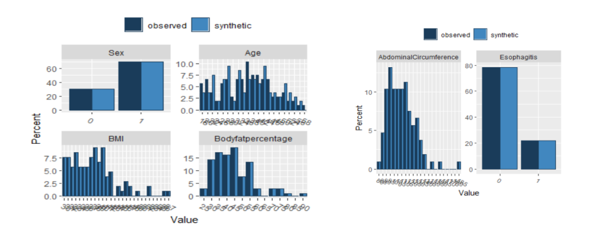
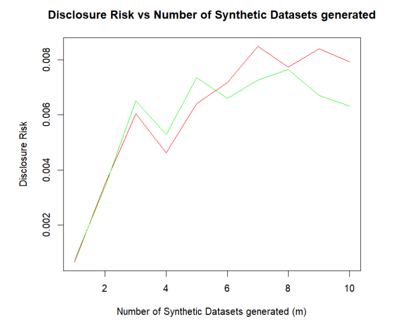
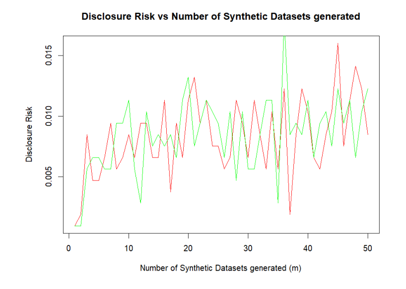
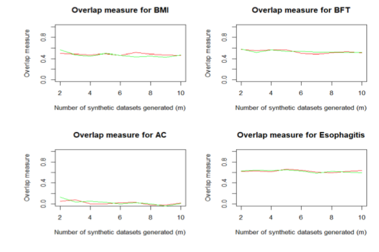
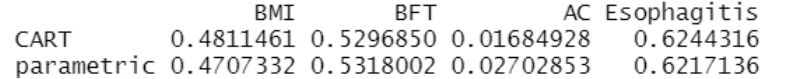
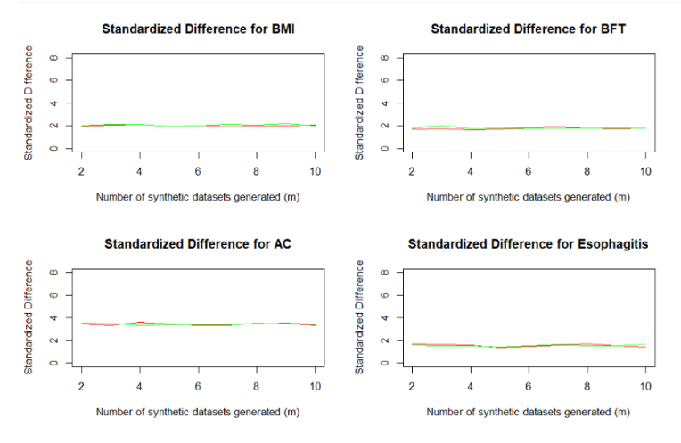
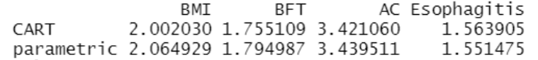

# Testing approaches to generating synthetic data

A major problem surrounding the release of datasets of experimental studies is how to maintain the privacy of the respondents. The corresponding risk of identity disclosure drastically limits sharing of scientific data. An increasingly plausible solution to reducing identity disclosure risk is to generate synthetic datasets, that is, datasets that are generated artificially to replace some sample data. In this project, CART and parametric methods of generating synthetic data are compared on a chosen dataset by calculating disclosure risks and data utility measures.\
The functions that were created are in *functions.R* Please note that some of the functions depend on some other functions that are not included here so it won't be possible to run some of the functions.

## Results
The main goals for this project is the assess the overall quality and usefulness of the synthetic datasets with respect to the original data. In particular, the disclosure risk and data utility measures are generated on differing numbers of synthetic datasets, and the results were compared.\ For the full methodology and results, please see *Report.pdf*. Here, a few interesting results are displayed. 

## Brief Conclusions
In this experiment, the parametric and CART methods performed nearly identically well. In particular, there were no substantial differences in disclosure risks, overlap measure, and standardized difference for any number of synthetic datasets generated.\
As *m* increases up until around *m* = 10, the disclosure risk is seen to increase for both methods which is expected. However, after as m increases further, there is no clear trend.\
As *m* increases, the Confidence Interval Overlap Measure and the Standardized Difference for this dataset appears to be constant, which is surprising.

## Authors

- [@jw8u](https://www.github.com/jw8u)

